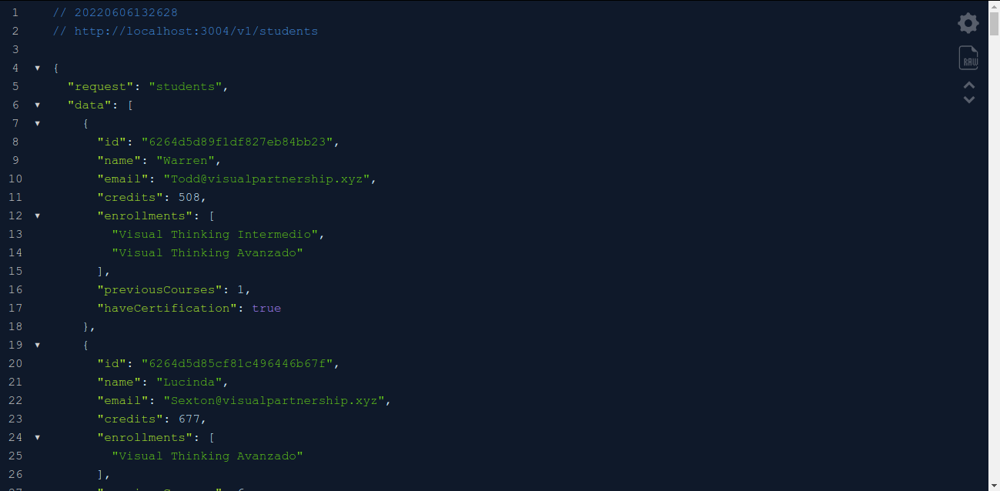
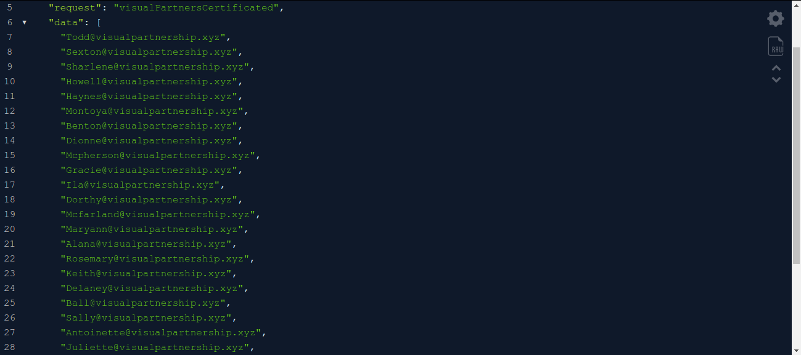
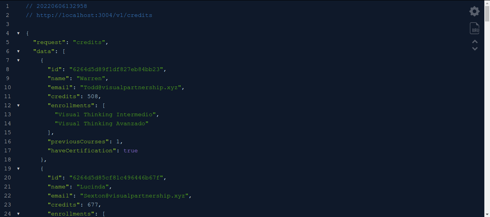

# Visual Partner-ship - Code challenge

## Table of Contents
1. [General Info](#general-info)   
   - Description
   - Requirements
   - API Design System  
2. [Getting started](#getting-started)
   - Pre-requisites
   - Installation
3. [Technologies](#technologies)
4. [Test Executing](#test-executing)
   - Automated tests
   - Unit tests
5. [Functionality](#functionality)
   - GET endpoint: Getting list of students
   - GET endpoint: Getting email's students which are certificated
   - GET endpoint: Getting students with credits higher of 500.
6. [Authors](#authors)
7. [Acknowledgements](#acknowledgements)

### General Info
***

#### Description
This documment explains how to build and consult a simple Web API application using a Visual Partners **[source data](https://gist.github.com/carlogilmar/1f5164637fb77aecef3b9e6b9e2a9b63)** which has simple information based on a MVC design pattern.   

#### Requirements
To make this API, you need to accomplish these requirements:
  - Enable an endpoint to get a students list with his fields.
  - Enable an endpoint to get student's emails that have a certification.
  - Enable an endpoint to get students with 500 or more credits.

#### API Design System
The following flowchart shows how this project was designed, considering SoD (Separation of dutties).

```mermaid
    flowchart LR
    Client<-->api
    VisualPartnersController<-->server
    Reader<--->VisualPartners
    
    subgraph Client
        Browser
    end
    subgraph API
        direction TB
        server---api
    end
    subgraph Controller
        direction TB
        subgraph controller
        VisualPartnersController    
        end
        subgraph services
            VisualPartnersService
        end
        subgraph utils
            Reader
        end

        utils<--->controller<--->services
    end
    subgraph Model
        VisualPartners
    end
```

Taking a look at the last flowchart, this was designed on a Model-View-Controller paradigm, considering that each component has its own functions.

   1. **Model**: As mentioned at the beginning of this section, the json file of VisualPartners will be the data source, stored on a array format.
   2. **Controller**: In this part, it was recommended to design under three important elements, to mantain a better modularity:
      - **Utils/Reader**: this component reads the source data, bringing it as a JSON object type.
      - **Services/VisualPartnerService**: it works like an extension of controller, providing only the logic functions that will manipulate the information stored on the model.
      - **controller/VisualPartnersController** it will manage the requests from the client and the responses of data manipulation that will be return to the API.
   3. **API**: it will host the server functionalities and the API with the parsed data.

### Getting Started
These instructions will get you a copy of the project up and running on your local machine for running and testing purposes.

#### Pre-requisites
- A code text editor where you can clone this repository. (VS Code, Vim, Atom, Brackets, etc.)
- CLI Command (preferly if you have a distro Linux, no matter if you're using PowerShell)
- Node.js installed (preferly the latest version) to run the project.
- NPM to download and install dependencies.

#### Installation
To install this project, just follow the instructions below.
1. Clone the project (if you are on VS Code, just press ```Ctrl + Alt + P```) and paste the repo link.
2. Install dependencies
3. Run the project
  
```
git clone https://github.com/MikoVelascoRamirez/VisualPartnershipCodeChallenge

npm install

npm start
```

#### Technologies
This project was build with:
- [Express 4.18.1](https://expressjs.com/) - A minimalist web framework for Node.js to create backend apps.
- [Jest 26.0.0](https://jestjs.io/) - A JavaScript test framework to unit tests.
- [Supertest 6.2.3](https://www.npmjs.com/package/supertest) - A npm module to test HTTP requests.
- [ESLint 8.15.0](https://eslint.org/) - Tool for identifying and reporting on patterns found in ECMAScript/JavaScript code

### Test executing
To run the unit tests, please execute the comand ```npm test javascriptfile.js``` in the path correct, to acceed to the test path, just type in the command line ```cd test/thefolderyouneed``` to run the unit tests.

#### Automated tests 
To run these tests, please make a push to the remote repository and go to the [**Actions section**](https://github.com/MikoVelascoRamirez/VisualPartnershipCodeChallenge/actions) to see the workflow execution.

#### Unit Tests
1. Suite tests of api (```test/api```)
   - **Testing endpoint GET /v1/students: status code**: run a unit test to ensure that the response returns a 200 status code.
   - **Test endpoint GET /v1/students: object type returned**: to ensure taht the endpoint will give us a JSON format object contained in response object.
   - **Test endpoint GET /v1/students: response generated**: ensuring if the endpoint returns a correct object which must be an array of students.
   - **Test endpoint GET /v1/emails: status code**: test the same as the first point.
   - **Test endpoint GET /v1/emails: object type returned**: test the same as the second ṕoint.
   - **Test endpoint GET /v1/emails: response generated**: ensure if the endpoint responses with an array of emails of students certificated.
   - **Test endpoint GET /v1/credits: status code**: test the same as the first point.
   - **Test endpoint GET /v1/credits: object type returned**: test the same as the second point.
   - **Test endpoint GET /v1/credits: response generated**: ensuring if the endpoint responses an array of visual partners with 500 or more credits.

2. Suite tests of controller (```test/controllers```)
   - **Test 1: source data**: test to ensure if the service provided to the controller returns a list of students.
   - **Test 2: filtering by certification**: to test if the service returns a list of students who are certificated.
   - **Test 3: filtering by credits**: ensure if the service returns a list with students with 500 or more credits.

3. Suite tests of service (```test/services```)
   This suite runs the same unit tests contained in the controller's. The difference between these is the definition of each one, where the tests in the service defines explicitly the way of repsond to the petitions in the API. Meanwhile, in the controller's only implements the services.

4. Suite tests of utils (```test/utils```)
   - **Reading file**: unit test which reads a path to check if .
   - **Verifying route**: unit test to check if the source of the data exists.
   - **Verifiyng file's content**: test if the file returns a list type object.
   - **Verifiying the availability**: we prove if the returned list contains data of students and doesn´t be empty.
   - **Checking data integrity #1**: test if each item of the list which is an object has all properties.
   - **Checking data integrity #2**: test if every value of each item is not null.  
   - **Checking data integrity #3**: test if every value of each item has the correct data type.

### Functionality
In this section, we're going to explain how you can use this app and what type of response is returned of every request.   
> *NOTE: Please check the section [Installation](#installation) to know how to execute this API.*

#### **GET endpoint**: Getting list of students

In this endpoint, we want to get a full list of students in the response, to ensure the data integrity, please open your browser and type the following url in the address bar.


After typing the url, you can see that the structure of every response should look like this:


We see a JSON response, which has two simple entries, the first with the name of *response* that indicates the endpoint required, and another one with the name of *data*, where the students information is stored.



If we display the shrinked data, we can see that every item on the list in field of data has a set of properties like *id*, *name*, *email*, *credits*, *enrollments*, *previousCourses* and a *haveCertification* boolean value, indicating if the student has a certification.

#### **GET endpoint**: Getting email's students which are certificated

In this endpoint, we get a list of students which are certificated. 
Typing the following url in the address bar:


we'll receive this:



We see a JSON response, which is a simple array that contains only the email's students.

#### **GET endpoint**: Getting students with credits higher of 500.

This endpoint returns a list of students which has 500 or more credits in his information.

Please type the url:


and we'll recieve the following JSON:



In the previous image, we see the list like a value in the entry *data*, with its respective petition, indicated on *request*.

### Authors
- [Miko Velasco Ramírez](https://github.com/MikoVelascoRamirez) - *Author of this repository and initial work*